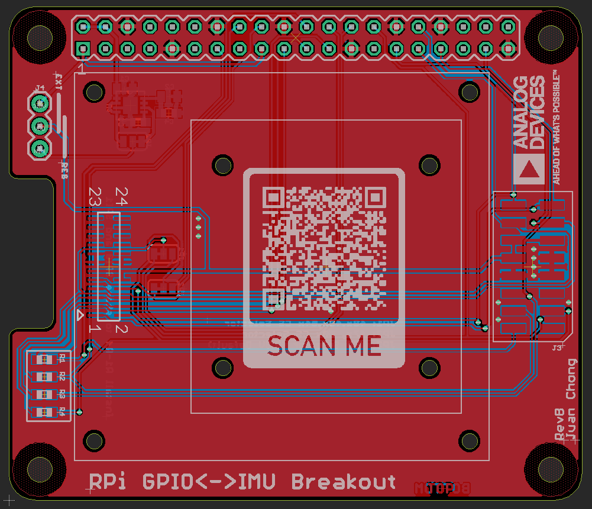

# ADI IMU Raspberry Pi Breakout Board
A simple Raspberry Pi breakout board (hat) for Analog Devices IMUs.

This board makes interfacing ADI IMUs with any platform that has a 40-pin connector compatible with the Raspberry Pi standard. 

## Design Features

This breakout board includes features that offer flexibility and expand compatibility with platforms beyond the Raspberry Pi and Jetson Nano. Features include:

1. Compatible with "compact" and "high-performance" ADI IMU families
   1. ADIS1647x
   2. ADIS1650x
   3. ADIS1648x
   4. ADIS1649x
2. Includes solder pads and resistor networks that enable making the following changes
   1. Sharing SPI1 between both sensors, or separating each sensor to it's own port (SPI1 and SPI2)
   2. Connecting the IMU VDD directly to the 5V supply
3. Includes a jumper that bypasses the onboard 3.3V regulator 

## Build Your Own

The PCB design is open-source and licensed under the MIT License. Copies of this circuit board may be purchased from OshPark [here](https://oshpark.com/shared_projects/AxJJlTrH).

| Designator     | Value              | Sub Allowed? |
| -------------- | ------------------ | ------------ |
| J1             | PPTC202LFBN-RC     | Y            |
| J2             | CLM-112-02-L-D     | N            |
| J3             | A3-16PA-2SV(71)    | Y            |
| J4             | 68000-203HLF       | Y            |
| U1             | ADM7172ACPZ-3.3-R7 | N            |
| C1, C2         | 10uF, 0805, 10V    | Y            |
| C3, C4         | 1uF, 0603, 10V     | Y            |
| R1, R2, R3, R4 | 0 ohm, 0603        | Y            |

